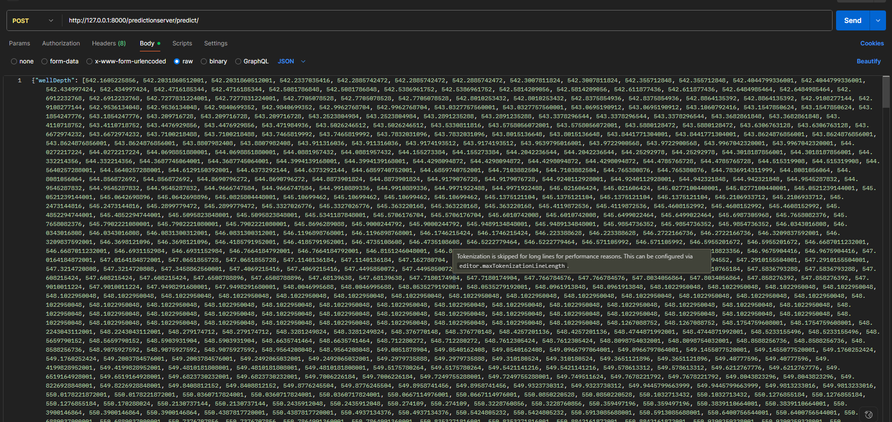
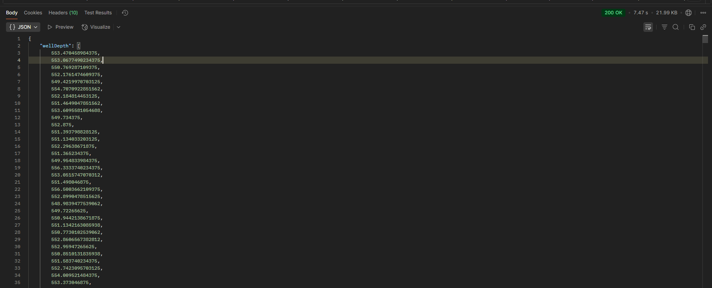

# PredictionServer [WIP]

Получает POST и выдает сгенерированные данные. Без БД.

## Общие сведения

Внутри несколько специализированных моделей ``TensorFlow``, работающие на разных потоках. В случае изменения архитектуры необходимо будет менять файлы ``services.py``, ``loader.py``, ``apps.py``.

### Точки входа

- ``/predictionserver/predict/`` - обрабатывает входящие данные датчиков через POST-запрос и возвращает результат.

- ``/predictionserver/schema/`` - автоматически генерирует схему API.

- ``/predictionserver/swagger/`` - предоставляет Swagger UI интерфейс для интерактивной документации API.

### Формат запроса

Принимается JSON следующей структуры (порядок обязателен):

```PowerShell
{
    "wellDepth": [массив чисел], 
    "bitDepth": [массив чисел],
    "wOB": [массив чисел],
    "sPP": [массив чисел],
    "flowRateIn": [массив чисел],
    "surfaceTorque": [массив чисел],
    "surfaceRPM": [массив чисел],
    "blockPosition": [массив чисел],
    "trippingSpeed": [массив чисел],
    "rOP": [массив чисел]
}
```


### Требования к входным данным

Во входных данных:
- Массивы обязательно непустые;
- Состоят из чисел с плавающей точкой;
- Имеют длину `settings.REQ_LENGTH_INPUT` (расположена в `settings.py`).

При ошибке валиадци данных вызывается `status.HTTP_400_BAD_REQUEST`.

### Формат ответа

Возвращается JSON следующей структуры (может иметь иной порядок):

```PowerShell
{
    "wellDepth": [массив чисел], 
    "bitDepth": [массив чисел],
    "wOB": [массив чисел],
    "sPP": [массив чисел],
    "flowRateIn": [массив чисел],
    "surfaceTorque": [массив чисел],
    "surfaceRPM": [массив чисел],
    "blockPosition": [массив чисел],
    "trippingSpeed": [массив чисел],
    "rOP": [массив чисел]
}
```

И ответ `status.HTTP_200_OK`. Размер массива чисел определяется в ``settings.EXIT_LENGTH``.
При ошибке валидации ответа вызывается `status.HTTP_500_INTERNAL_SERVER_ERROR`.

## Требования

- Python 3.12.2+;
- библиотеки и их версии, указанные в `requirements.txt`.

## Установка
(Для Windows)
1. Клонируйте репозиторий:
```PowerShell
git clone https://github.com/Dogger1980/PredictionServer.git
```
2. Перейдите в ``...\nnpredictor``. Создайте и активируйте виртуальное окружение:
```PowerShell
python -m venv venv
.\\venv\Scripts\activate
```
3. Вернитесь в предыдущую директорию и установите зависимости:
```PowerShell
pip install -r requirements.txt
```
4. Перейдите в ``...\nnpredictor\nnpredictor`` и запустите сервер:
```PowerShell
uvicorn nnpredictor.asgi:application
```

API будет доступен по адресу ``http://127.0.0.1:8000/predictionserver/predict/``.

## Примеры запросов и ответов

### Пример 1

Используя ``httpie`` и ``PowerShell`` (``pip install httpie``):

#### Запрос

```PowerShell 
http POST http://127.0.0.1:8000/predictionserver/predict/ wellDepth:='[1.1, 2.2, 3.3]' bitDepth:='[4.4, 5.5, 6.6]' wOB:='[7.7, 8.8, 9.9]' hookLoad:='[10.1, 11.1, 12.1]' sPP:='[13.1, 14.1, 15.1]' flowRateIn:='[16.1, 17.1, 18.1]' surfaceTorque:='[19.1, 20.1, 21.1]' surfaceRPM:='[22.1, 23.1, 24.1]' blockPosition:='[25.1, 26.1, 27.1]' trippingSpeed:='[28.1, 29.1, 30.1]' rOP:='[31.1, 32.1, 33.1]'
```

#### Ответ

```PowerShell 
HTTP/1.1 200 OK
Allow: POST, OPTIONS
Content-Length: 14690
Content-Type: application/json
Cross-Origin-Opener-Policy: same-origin
Referrer-Policy: same-origin
Vary: Accept, Cookie
X-Content-Type-Options: nosniff
X-Frame-Options: DENY
date: Wed, 25 Jun 2025 19:15:04 GMT
server: uvicorn

{ 
    "bitDepth": [3.1331143379211426,5.2691850662231445,...], 
    "blockPosition": [...],
     ...
}
```

### Пример 2

Используя ``POSTMAN``.

#### Запрос



#### Ответ

